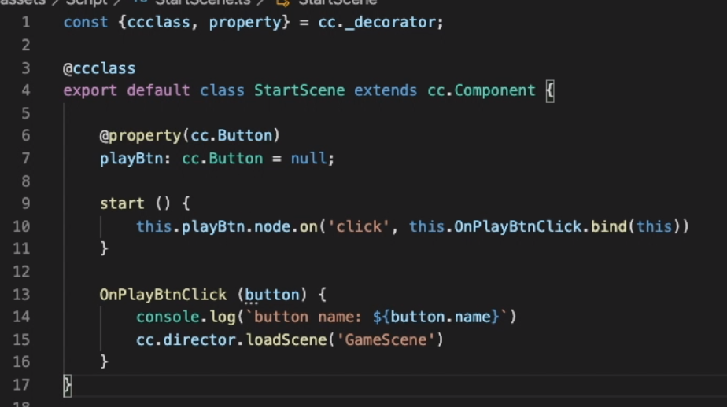

# 响应事件

res

script

scenes

## 触摸事件

- 类型

  - start:触摸点下
  - moved：触摸移动
  - ended:弹起
  - cancel：物体外弹起

  游戏的触摸事件不是直接通过操作系统 给的，它是通过我们的引擎（框架）给的。所以吸引注册。

- 监听触摸事件

  - 注册 触摸事件：向游戏引擎注册 一个回掉函数，当触摸事件发生的时候调用回调函数

    - cc.Node.EventType.TOUCH_START:触摸开始
    - cc.Node.EventType.TOUCH_MOVE:触摸移动
    - cc.Node.EventType.TOUCH_END:触摸弹起
    - cc.Node.EventType.TOUCH_CANCEL:触摸结束

  - 注册 方式

    - on（type，callback，target，一般使用默认）

      ```javascript
      this.node.on(cc.node.EventType.TOUCH_START,function(t),this);
      ```

      

- 关闭触摸事件

  - this.node.off();

    ```java
    -修改前
    this.node.on(cc.node.EventType.TOUCH_START,function(t),this); 修改
    -修改后
    on_move:function(t){
        console.log("cc node eeeexxxx");
    }
    this.node.on(cc.node.EventType.TOUCH_START,on_move,this);
    
    - 取消
    this.node.off(cc.node.EventType.TOUCH_START,on_move,this);
    
    - 取消 所有的事件
    this.node.taroff(this); 
    ```

- targetoff（target）移除所有的注册事件\

  - 回调函数  functionn(t) -->  cc.Touch对象触摸事件对象  t就是cc.Touch
  - 触摸的位置：左下角为原点   t.getLocation
  - 上次的偏移：t.getDelta()

- 回调函数的参数设置 function(t(cc.Touch))

- cc.Touch:getLocation返回触摸事件的位置，getDelta返回距离上次的偏移

- cc.Event:stopPropagationImmediate/stopPropagation停止事件的传递

## 事件冒泡

一个子节点有了点击事件，它的事件也属于整个父类，然后事件向上传递。孩子收到 之后传递给父亲，父收到在向上传递


## 键盘事件

- cc.SystemEvent.on(type,function,target,useCapture)
- 类型：cc.SystemEvent.EnevtType.KEY_DOWN,cc.SystemEvent.EventType.KEY_UP
- 配置回调函数
- 每个按钮会对应一个按键码
- cc.SystemEvent小写systemEvent

代码块

```javascript
onLoad:function(){
    //注册
    cc.systemEvent.on(cc.SystemEvent.EventType.KEY_DOWN,this.on_key_down,this);
	cc.systemEvent.on(cc.systemEvent.EventType.KEY_UP,this.on_key_up,this);
},
    
on_key_down:function(event){
    console.log(event.keycode);
}
```


## 自定义事件

谁是接收者，谁是发送者

```java
express
//接收者
onLoad：function(){
    this.node.on("pa_event",function(e)){
        console.log("XXXXXXXXXXXXXXX");
    }
}
//派发者
this.node.emit("pa_event");

onLoad：function(){
    this.node.on("pa_event",function(e)){
        console.log("XXXXXXXXXXXXXXX",e.detail);
    }
}
//派发者（发送自己）
this.node.emit("pa_event",{blake:"xxx"});

//发送别人   事件   向上传递
var e = new cc.Event.EventCustom("pkg_event",true);
```

事件的向上传递就是孩子节点的任务，在父节点也是可以获取到的。

- 监听 this.node.on("自定义事件名称"，function，target,useCapture);
- 触发：emit("事件名称",[detail]);只有自己可以接受事件
- 冒泡派送：dispatchEvent(new cc.Event.EventCustom("name",是否冒泡));


## 事件绑定的使用




