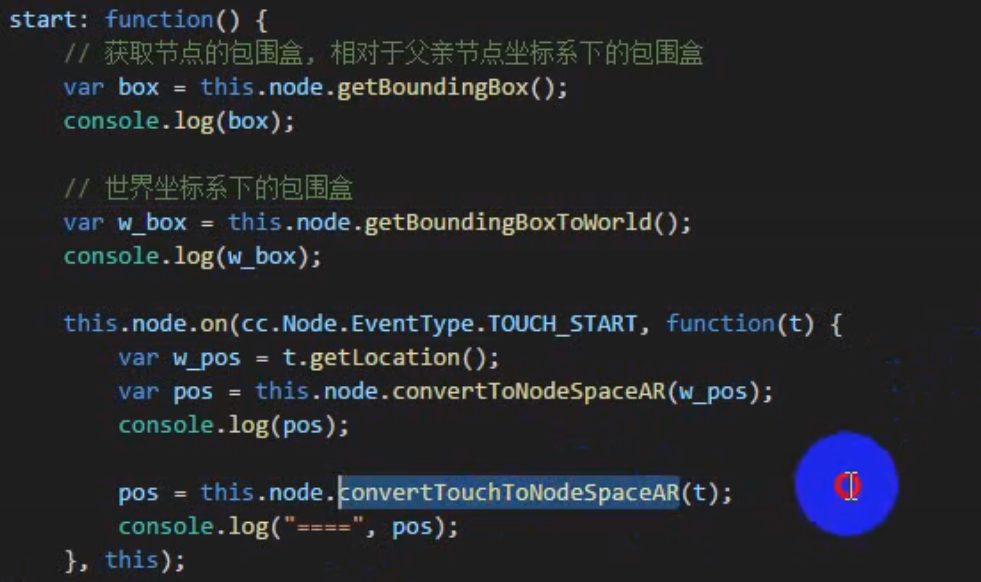

# 坐标空间

创建的脚本是挂载到组件上面的。

## Vec2

cc.Vec2：二维向量

```javascript
var vec = new cc.Vec2(x,y);  //new
var pos = cc.v2(200,200);  //全局常量
var pos = cc.p(300,300);   //全局常量
```

### 计算

```javascript
cc.pSub(dst,src);   //减去之后的
距离/长度   00到点的大小
```

## 常用方法

- cc.rect()
- cc.size()
- cc.contais(point)


### 坐标系

- 世界  （屏幕）  左下角  
- 相对   （节点坐标）  原点查找方式
- 节点坐标和屏幕坐标的相互转换
- 获取在父亲节点坐标系下的节点包围盒
- 获取世界坐标下的节点包围盒
- 触摸事件对象世界坐标与节点坐标的转换

### 坐标转换

节点坐标转换到屏幕坐标

```javascript
this.node.convertToWorldSpace 左下角为远点的
```

### 包围盒

```java

```

### 触摸事件的大小

  