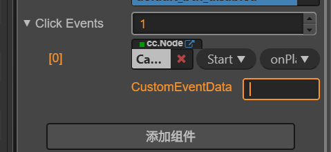

# 场景创建

资源都放在assets文件夹下，资源的管理都通过mate进行管理，它是资源的描述文件。

## 场景切换

```java
setTimeout(()=>{
    cc.director.loadScene("GameScene",()=>{
        console.log("------------>");
    })
},2000);
```

几个生命周期方法

```java
    onLoad(){
		//加载
    }

    start () {
        // init logic
        this.label.string = "loading……";
        setTimeout(()=>{
            cc.director.loadScene("GameScene",()=>{
                console.log("------------>");
            })
        },2000);
    }

    update(){

    }

    destroy(){
        return false
    }
```

执行的过程中，回调函数会在onLoad之后，start之前执行。

## 按钮的使用

### 方式一

通过编辑器进行添加事件，在ts文件中写入方法

```java
onPlayBtn(){
    console.log("playbtn ……");
}
```

通过编辑器将事件加入到里面



### 方式二

使用绑定的方式进行

```java
export default class StartScene extends cc.Component {

    @property(cc.Button)
    playBtn: cc.Button = null;

    start () {
        方法获取不到this，所以使用这个方式
        let self= this;
        this.playBtn.node.on("click",function(Button){
            self.onPlayBtn();
        });
    }

    onPlayBtn(){
        console.log("playbtn ……");
    }
}
```

当方法的里面不能访问this的使用，可以在外面创建一个this变量，然后通过this变量来进行访问。

```jav
let self = new this;
```

解决的方式二 

```java
 this.playBtn.node.on("click",(Button)=>{
     this.onPlayBtn();
 });
也是比较推荐的一种做法
```

### 方式3

```java
this.playBtn.node.on("click",this.onPlayBtn);  这种方式就是在方法里面是不可以使用到this的，如果需要使用那么就需要执行下面的方式
this.platBtn.node.on("click",this.onPlayBtn.bind(this));

this.platBtn.node.on("click",this.onPlayBtn,this);
```

如果代码能力强可以使用后面两种，如果不强可以使用第一种，


## 总结

### cocos creator

1.场景切换使用导演加载一个GameScene

2.点击事件的几种方式。

### ts

1.