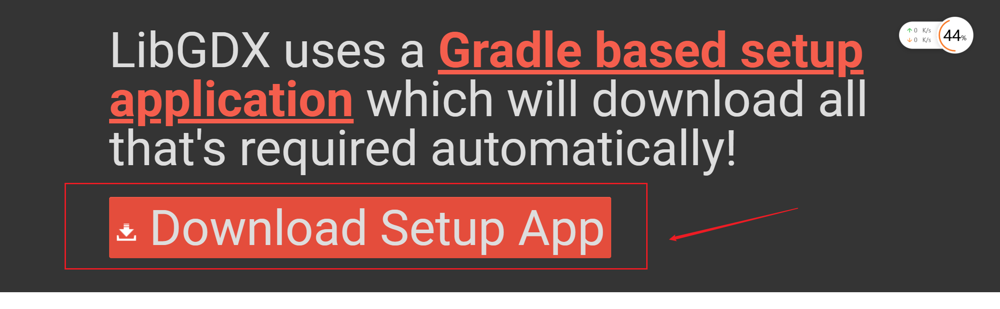
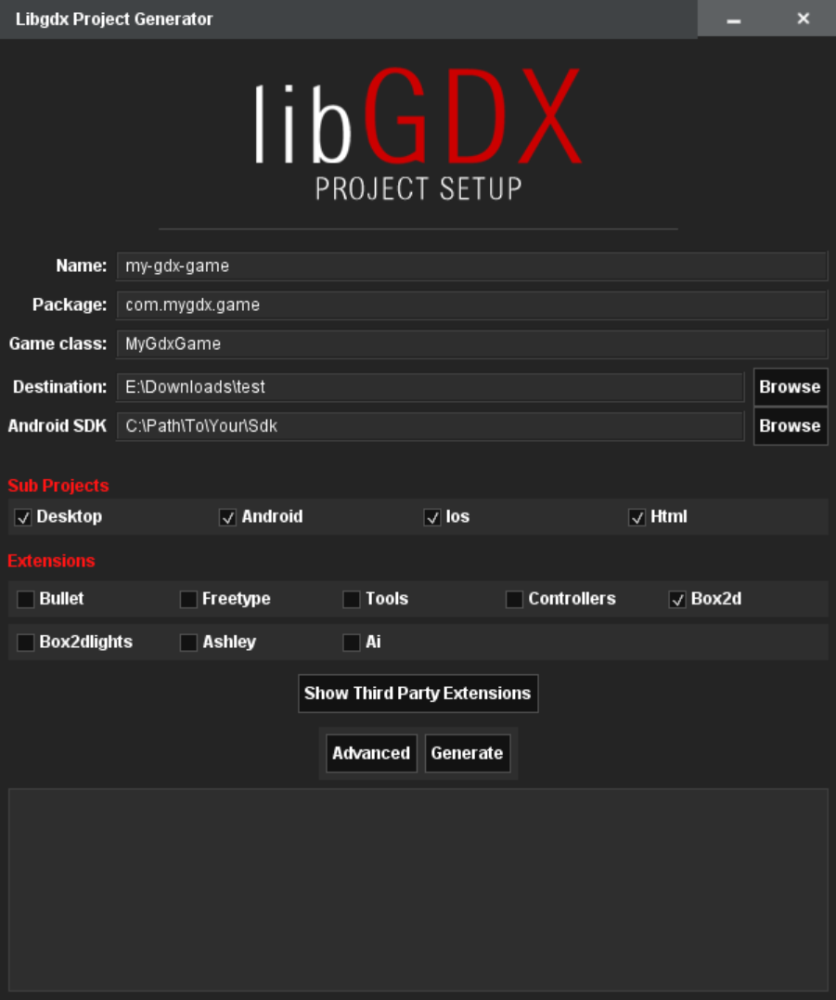

# box2D环境搭建

导入依赖靠天吃饭，不能任何修改。

目前的搭建是通过导入gradle依赖，使用gdx-step进行搭建。

##  下载创建器

https://libgdx.badlogicgames.com/download.html



## 创建



将自己需要的模块选择即可。

## 创建失败

- 文件下载不了的，不需要关心，增加源，然后通过idea进行下载就可以了。

  ```java
  导入仓库地址   
  repositories {
      maven { url 'http://deltadna.bintray.com/android' }
      maven { url 'http://maven.aliyun.com/nexus/content/repositories/google' }
      maven { url 'http://maven.aliyun.com/nexus/content/repositories/jcenter'}
      mavenCentral()
          maven { url "https://oss.sonatype.org/content/repositories/snapshots/" }
      maven { url "https://oss.sonatype.org/content/repositories/releases/" }
  }
  ```

## 源码导入

