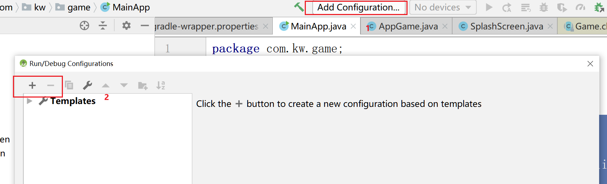

# 前置知识

目前我所知道的，游戏有一个game，game里面可以创建场景，场景的下面创建舞台，舞台上是演员的表演。一般我们为了方便管理，项目的结构：

- 我们创建自己的Game，自己的game继承官方的game。
- 我们创建场景，将场景放进我们的游戏。
- 在创建上创建舞台(舞台上有Group可以存放我们的view)
- 我们在舞台上布局和书写逻辑。

## 基本案例

### 创建我们自己game.

```java
public class AppGame extends Game {
	
	@Override
	public void create () {
    }

	@Override
	public void render () {
	
	}
}

```

两个主要的方法

- create:我们游戏开始的时候最先执行的方法
- render:我们的渲染就放在这里（后面会分析源码）

### 创建我们的screen

我们的场景创建之后是放到游戏中的。

```java
public class BaseScreen implements Screen {
   
    @Override
    public void show() {
        第一次执行的
    }

    @Override
    public void render(float delta) {
 		//渲染部分
    }
    @Override
    public void resize(int width, int height) {

    }

    @Override
    public void pause() {

    }

    @Override
    public void resume() {

    }

    @Override
    public void hide() {

    }

    @Override
    public void dispose() {

    }
}
```

### 创建stage

stage的创建我们直接new就可以了。

```java
stage = new Stage(AppGame.getViewPort(),AppGame.getBatch());
```


## 整合

我们的主角已经齐全了，game screen stage.下来让他们一起协作。

game里面是需要放入的是screen

```java
public class AppGame extends Game {
	private static Viewport viewPort;
	private static Batch batch;

    /**
    最开始的使用执行，那么就可以通过这里创建一些必须的还有全局的
    */
	@Override
	public void create () {
        //创建视口  先这样写着，将几种页面的布局和适配的时候在修改
        viewPort = new ExtendViewport(720,1280);
        //创建场景    将我们的欢迎页面放进去
        setScreen(new SplashScreen());
	}

	@Override
	public void render () {
		super.render();
	}

    //-----------------------------------
    //创建stage的时候使用
	public static Batch getBatch(){
	    if (batch == null){
            batch = new CpuSpriteBatch();
        }
	    return batch;
    }
	
    public static Viewport getViewPort() {
        return viewPort;
    }
    //----------------------------------
}

```

整合了game和screen，下来整合screen和stage。

- screen中需要放的是stage
- stage中放入 的是view(Actor)

```java
public class BaseScreen implements Screen {
    private Stage stage;
    protected Group rootView;

    @Override
    public void show() {
        //
        stage = new Stage(AppGame.getViewPort(),AppGame.getBatch());
        if (rootView!=null){
            stage.addActor(rootView);
        }
    }
    @Override
    public void render(float delta) {
        Gdx.gl.glClearColor(0.2F,0.2F,0.2F,1);
        Gdx.gl.glClear(GL20.GL_COLOR_BUFFER_BIT|GL20.GL_DEPTH_BUFFER_BIT);
        if (stage!=null){
            stage.act();
            stage.draw();
        }
    }
    @Override
    public void resize(int width, int height) {

    }

    @Override
    public void pause() {

    }

    @Override
    public void resume() {

    }

    @Override
    public void hide() {

    }

    @Override
    public void dispose() {

    }
}
```

我们放入一个view来一下

```java
public class SplashScreen extends BaseScreen {
    public SplashScreen(){
        //创建view;
        rootView = new SplashView();
    }
    @Override
    public void show() {
        super.show();
    }
}
```

### 游戏执行入口

先做Desktop,后面在加入android

```java
public class MainApp {
	public static void main (String[] arg) {
		LwjglApplicationConfiguration config = new LwjglApplicationConfiguration();
//		new LwjglApplication(new AppGame(), config);
        new LwjglApplication(new AppGame(), config);
	}
}
```


## android studio配置




 

## 总结

完成项目架构的搭建，下面开始将代码封装，我们的一个stage是一个舞台，舞台上的东西，由两个部分组成，一个是view和controller.

约定：

- view表示一个页面
- dialog表示游戏中的弹窗
