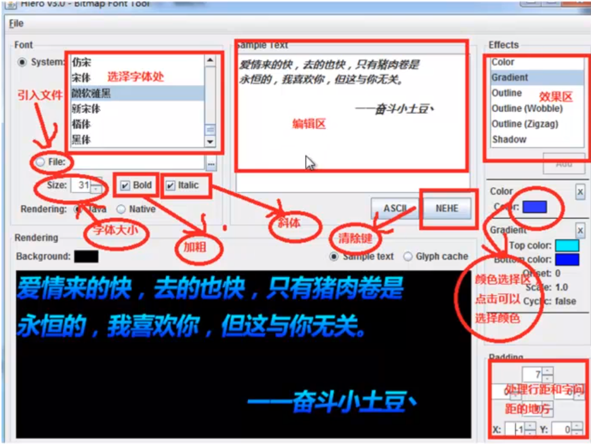

# 文字的显示

- 我们使用Hiero工的使用
- BitmapFont类介绍
- 通过BitmapFont绘制中文

## Hiero

专门用来做字体文件的，使用fft文件做出来.fnt和png两个文件。

工具的界面以及说明：




## BitmapFont类

读取两个文件，一个是图片，还有一个是配置文件，可以设置静态文本，也可以设置文字的颜色、大小等。 

BitmapFont的第三个参数设置表示是否可以进行翻转。

  多行显示  和  start end 从哪里开始，到哪里结束

```
  
    @Override
    public void create() {
        batch = new SpriteBatch();
        bitmapFont = new BitmapFont(Gdx.files.internal("font100-500.fnt"),
                Gdx.files.internal("font100-500.png"),false);
    }

    @Override
    public void render() {
        super.render();
        Gdx.gl.glClearColor(0,0,0,1);
        Gdx.gl.glClear(GL20.GL_COLOR_BUFFER_BIT);
        batch.begin();
  		//绘制
  		bitmapFont.draw(batch,"fbhhgg",100,100);
        batch.end();
    }
```


