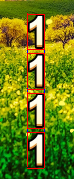

# 布局技巧

1.水平布局

```java
final Table panel = new Table() {{
    final float SPACING = 8;
    add(image1).space(SPACING);
    add(image2).space(SPACING);
    add(image3).space(SPACING);
    add(image4).space(SPACING);
    pack();
    setDebug(true);
}};
```

2.竖直布局

```javascript
final Table panel = new Table() {{
    final float SPACING = 8;
    add(image1).space(SPACING).row();
    add(image2).space(SPACING).row();
    add(image3).space(SPACING).row();
    add(image4).space(SPACING).row();
    pack();
    setDebug(true);
}};
```




## dialog处理

push到栈中，设置，pop弹出，清除

```
public void pushScreen(Screen screen) {
  if (this.screen != null) {
    screens.add(this.screen);
  }

  setScreen(screen);
}

//不理解  还不是原来的哪一个吗？？
public void popScreen() {
  assert screens.size > 0;
  setScreen(screens.pop());
}

public void clearAndSet(Screen screen) {
  for (Screen s : screens) s.dispose();
  screens.clear();
  setScreen(screen);
}
```

## 参数


