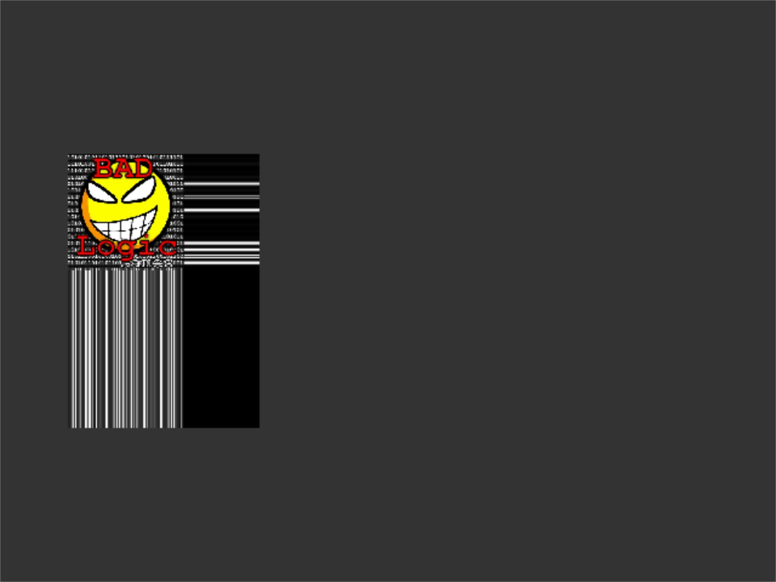
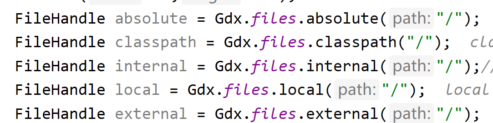
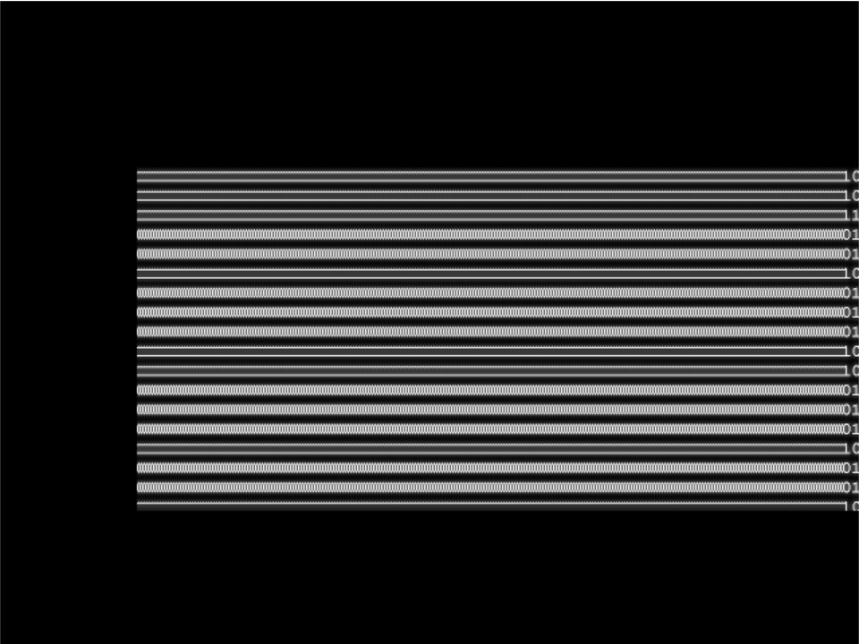

# 基础部分

基础部分会涉及到一些资源的使用，但不会太深，都是游戏中一直使用的，第二个阶段在当前笔记的基础上，向深的挖掘一些。

纹理开始，libGdx里面可以进行画图，各种形状，但是在我目前的使用的过程中都使用的是纹理。

## 纹理

纹理可以理解为一张图片。就是将原始格式解码并上传到GPU的过程被称为纹理，就是承载图片的容器。

### 加载纹理

```java
Gdx.files.XXX("path"); 得到的是一个fileHandle;
```

### 纹理的使用

一般纹理在游戏中不直接的进行使用，游戏中都是演员，texture并没有继承它，所以使用的时候一般是和Image一起使用的。纹理我认为 是一些相对底层点的概念吧。

```
Texture imageTexture = new Texture(Gdx.files.internal("badlogic.jpg"));
Image image = new Image(imageTexture);
addActor(image);
```

## 画笔（SpriteBatch）

用来画图片的.图片是一个2的整数次幂 （好像是为了效率）。它就是用来画图的，批量处理的。

为什么需要处理2的N次方图片，openGl 1.0有要求，2.0没有这个要求了。

不过在libGdx中使用的依旧是2的指数幂，虽然我们给的图片并不是，但是代码里面有了处理。好处就是可以减少包体大小。

## 画图小Demo

我们已经搭建好了项目架构，我们在指定的位置写入代码就可以看到结果。

```
public class SplashView extends BaseView {
    public SplashView(){
        setSize(720,1280);
        Texture imageTexture = new Texture(Gdx.files.internal("badlogic.jpg"));
        Image image = new Image(imageTexture);
        addActor(image);
    }
}
```

目前就将图片显示出来了。

## 对图片进行操作

### 位置修改

```
image.setPosition(100,100);
```

### 旋转

```
image.setRotation(100);//旋转的中心在左下角
```

### 设置颜色

```
image.setColor(Color.CLEAR);
image.setColor(Color.valueOf("333333"));
```

设置颜色的原理：比如开始为白色，使用红色画笔去画，就相当于你用了一个红色的笔去画出了一个图片，颜色是叠加在上面的。如果需要画出颜色质感和原理一样的那种效果，需要使用shader。

## TextureRegion

纹理区域，可以理解为截取的区域。

```
TextureRegion region = new TextureRegion();
region.setTexture(new Texture(Gdx.files.internal("badlogic.jpg")));
region.setRegion(0,0,421,601);
Image image = new Image(region);
image.setPosition(getWidth()/2,getHeight()/2,Align.center);
addActor(image);
```



可以得到结论，如果texture的寸尺比设置的小，就会从边缘进行拉伸。

截取的开始位置是左上角，然后向下，向右进行拉伸

这个是texture的默认方式，也可以设置为重复等。

### Sprite

我用的少，它是继承textureRegion,绘制也不通过batch的画方法，而是自己画。我看完回来补充……。

------补充----------
sprite和TextureRegion类似，设置了图片的uv坐标，
它指定了图片的顶点坐标，移动、旋转等操作都是通过操作坐标完成的。


## 扩展

### Gdx.files.xxx()




都是读取资源的一种方式，internal一般比较常用，其他的我用的不多，文件目录，差别就是他们对文件的操作位置和操作权限的差别。

classpath:文件通常为只读

Internal:内部文件路径

External:外部路径，相对于SD卡

### 使用batch画图

```java

public class TextureDemo extends Game {
    private Batch batch;
    private Texture texture;
    @Override
    public void create() {
        batch = new SpriteBatch();
        texture = new Texture(Gdx.files.internal("badlogic.jpg"));
    }

    @Override
    public void render() {
        super.render();
        batch.begin();
        batch.draw(texture,100,100);
        batch.end();
    }
}

```

上面的代码没有清屏，先看一下没有清屏有什么效果。



```java
package com.kw.origin;

import com.badlogic.gdx.Game;
import com.badlogic.gdx.Gdx;
import com.badlogic.gdx.graphics.Texture;
import com.badlogic.gdx.graphics.g2d.Batch;
import com.badlogic.gdx.graphics.g2d.SpriteBatch;

public class TextureDemo extends Game {
    private Batch batch;
    private Texture texture;
    @Override
    public void create() {
        batch = new SpriteBatch();
        texture = new Texture(Gdx.files.internal("badlogic.jpg"));
    }

    float x = 0;
    @Override
    public void render() {
        super.render();
        batch.begin();
        x ++;
        batch.draw(texture,100+x,100);
        batch.end();
    }
}

```


