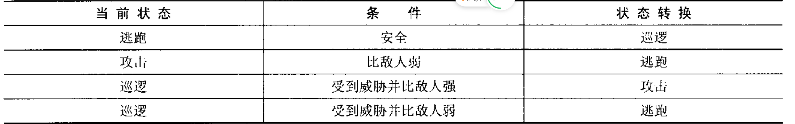
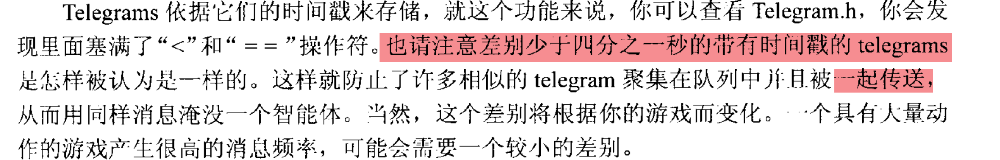

# 状态

有限状态的例子，pacman幽灵一直有自己的有限状态机，存在一个规避状态，每个都有自己的目标，玩家吃了一个药丸之后，就会从追踪变为规避。

## 有限状态机的实现

有限状态机，基本的实现就是if-then或者是switch实现。

```java
switch(state){
    case runState:
        if（plays.isSafe()）{
            
        }else{
            
        }
        break;
}
```

当状态非常多的时候就不在实用了。难以扩展，难以维护。

有时候有的状态只在开始游戏和结束 游戏的时候，并不是在贯穿整个游戏的。

### 状态变换



可以在间隔内进行访问，在某种刺激之后进行游戏状态的变化，每个状态可以分割为一个类或者是一函数，提供一个清楚的灵活的结构。

增加新的状态的时候，只需要增加一个新的指令，每次加入的时候只需要将加入崇训编程转换规则，其他的模块是不需要关心的。


### 内置规则

状态内置到状态本身内部，比如玩耍模块监听到小猫饿了就会将状态进行变化。

举例：

士兵在逃跑的过程中自己是安全的就会停下来休息。

- 状态

  ```java
  abstract class State{
      abstract void excete(shibing);
  }
  ```

  

- 士兵

```java
class Soler{
    private State sate;
      void changeState(State state){
          this.state = state;
      }
    void update(){
        state.excete(this);
    }
}
```

- State_RunnAway

  ```java
  class State_RunnAway extends State{
   	void excete(Soler soler){
          if(soler.safe()){
              soler->changeState(new State_Sleep());
          }else{
              soler->moveAwayFromEnemy();
          }
      }   
  }
  ```

我们床架各种状态，然后我们将对象传递过去，根据目前的状态状态执行不同的逻辑。


## 西部世界

一个居民/一个矿/一个酒吧/家睡觉。每次状态改变就会执行一个状态。

### BaseGameEntity

所有的居民都需要继承的，是一个用于简单的用于存储ID号码的，提供一个函数更新状态，每个更新都需要执行它。

```java
class BaseGameEntity{
    int m_ID;
    int m_iNextValidID;//下一个有效的ID,每次实例化的时候都会执行
    void setId(int val); //构造函数中被正确的设置，设置ID和增量，  校验值是否大于下一个ID
    BaseGameEntity(int id){
        setId(id);
    }
    void updata(){
        
    }
    
    int geyId(){
        return m_ID;   //唯一标识的
    }
}
```

状态：比如位置/疲劳等

```java
class Miner:BaseGameEntity{
    State 
        、;
    location_type m_Location;
    int m_iMoneyInBank;
    int m_iThirst;
    int m_isFatigue;
    
    void update(){
        m_iThirst+=1;
        if(m_pCurrentState){
            m_pCurrentState->execute(this);
        }
    }
}
含有一个State实例还有一个是改变指针指向的某个状态

```

Miner状态

- 金子
  - 有：挖矿、
    - 口渴--》
  - 无：移动
- 存钱
- 困了睡觉


## 总结

人继承BaseGameEntity,每次状态改变都会执行当前 状态中 的方法，当满足条件之后就会改变状态。


举例：

我是一个Entity，我有在家看书，吃饭睡觉的状态。

我需要继承BaseEntity

```java

```


## 全局状态和状态翻转

有的状态是每一种里面的都会存在的，比如口渴，比如上厕所，这种可以创建一个全局的状态，每次状态进行更新都会进行执行。我们需要加入一个额外的成员变量。

状态翻转：让智能体带着一个条件进入有一个状态也会带来方便，当退出时返回前一个状态。

比如在一个状态需要去厕所，但是都必须返回前一个的状态，这就需要加入一些新的逻辑。

```java
Miner:
class Miner extends BaseEntity{
    State currentState;
 	State previousState;
    State globalState;
    changeState(){
        
    }
    revertToPreviousState();
}
```


## StateMachine

通过将所有与状态有关的数据封装到StateMachine类中，

```java
class StateMachine{
    Entity entity;
    State currentState;
    State previousSate;
    State golbalState;  //每次执行的状态    全局状态
    
    void changeState(State state){
        m_previousState = currentState; //保存前一个
        目前的方法退出
        currentState.exit(entity);
        currentState = newState;
        currentState.enter(entity);
    }
    
    //返回前一个状态
    void changePrevious(){
        changeState(previous)
    }
}
```

Miner中就需要使用这个实体类了。

## 消息功能

游戏趋向于事件驱动，一个事件发生，会传播给其他相关的对象，做出正确得响应，一个数据包的形式发送。

- 发送什么？
- 做什么反应？
- 事件是什么？


### 为什么使用事件驱动

具有高效率，如果不使用，那么对象需要一直的去检查是否满足某个状态，直到收到一个广播之后，就会执行广播的任务。

- 一个巫师向一个妖魔仍火球：巫师发出消息，妖魔做出动作。

### TeleGram结构

消息是简单的枚举，我们需要发送的时候将信息封装在一个Telegram结构中。

```java
class Telegram{
    int sender;
    int receiver;
    int msg;
    double dispatchTime; //延迟
    void extraInfo;
}
```

可以重构的。

## 交流

我什么时候下班？？？ 饭在哪里

enum{

​	Msg_XIANBAN;

​    Msg_CHIFAN

}

管饭的阿姨发送消息可以吃饭了，老板发消息可以下班了。


**突然明白了之前 为什么需要回到直到的状态了，因为全局的动作，比如上厕所，上完之后呢？？返回前一个状态**


## 消息发送 和 管理

创建发送管理telegram由MessageDispatcher类完成的，智能呢个的无论何时发送一条消息，都会调用MessaheDiapatcher并加上必须的信息。。MD通过信息来创建一个Telegram,然后被发送或者是进入队列。

我们需要直到传递给谁，通过id定位目标。

```java
class EntityManager{
    private HashMap<int,BaseEntity> hashMap = new HashMap();
    add();
    remove();
    
}
```

## MessageDispatcher类

管理者发送消息，称为一个MessageDispatcher.

```java
class MesageDispatcher{
    //消息发送的顺序   按照事件排序
    Queue <Telegram> queue= new Queue();
    //DispatchMessage   DispatchDelayMessage利用，使用最新创建的telegram调用接受实体的消息处理函数receiver
    void Discharge(Entity receiver,Telegram msg);
    DispatchMessage(double delay,int sender,int receiver,int msg,void extraInfo);
}
```

MessageDispatcher处理立即消息和时间错的消息.

```java
DispatchMessage(double delay,int sender,int receiver,int msg,void extraInfo);
```

实体打死一个消息 给 另一个实体 的时候方法被调用，发送者需要提供发送ID,接收者ID和本身消息，还有事件延申。需要立即发送的就需要使用一个0值或者是一个负的延迟来调用。

```java
Entity entity = EntityM.getEntityId(receiver)；//得到信息接收者实体
Telegram telegram(delay,sender,receiver,msg,ExtraInfo)//创建telegram
if(delay<=0.0){
    Discharge(entity,telegram);
}
```

比如我打了机器人他接收到信息，做出相应的动作。

还有一种是带有延迟的

```java
double currentTime = System.currentTime();
telegram.dispatchTime = currentTime+delay;
//放入延迟队列
queue.add(telegram)//这个队列需要是一个优先据队列
   //队列这个有点问题 ，应该选用可以除去重复的
    
```




优先级队列会对dispatchDelayedMessage得到检查排队的telegram，查看telegram时间戳是否过期，如果过期发送并删除


## 消息处理

修改BaseEntity类以便任何子类可以接收消息，创建处理函数HandleMessage。

之前的:

```java
class BaseGameEntity{
    int m_ID;
    int m_iNextValidID;//下一个有效的ID,每次实例化的时候都会执行
    void setId(int val); //构造函数中被正确的设置，设置ID和增量，  校验值是否大于下一个ID
    BaseGameEntity(int id){
        setId(id);
    }
    void updata(){
        
    }
    
    int geyId(){
        return m_ID;   //唯一标识的
    }
}
```

修改之后

```java
class BaseGameEntity{
    int m_iNextValidID;//下一个有效的ID,每次实例化的时候都会执行
    void setId(int val); //构造函数中被正确的设置，设置ID和增量，  校验值是否大于下一个ID
    BaseGameEntity(int id){
        setId(id);
    }
    void updata(){
        
    }
    
    int geyId(){
        return m_ID;   //唯一标识的
    }
    
    bool handleMessage(Telegram t){
        
    }
}
```

修改State：

```java
class Sate{
    //增加一个方法
    bool onMessage(entity ty,Telegram t);//接受消息
}
```


修改StateMachine

```java
bool handleMessage(Telegram msg){
    //当前的
    if(currentState && currentSate.onMessage(ower,msg)){
        return true
    }
    //全局的
    if(golbalState && golbalState.onMessage(ower,msg)){
        return true;
    }
    
   return false;
}
```

Miner

```java
bool handleMessage(Telegram msg){
    stateMachine.handleMessage(msg);
}
```


## 案例

我想喝水，

workState

```java
class workState{
    //……
    void enter(Miner m){
        //发送消息
        Dispatch.dispatchMessage(delay,
                                sendId,
                                receiverId,
                                msg,
                                No_ADDITIONAL_INFO)
    }
    //……
}
```


接受到 消息

```java
class xxState{
    bool onMessage(xxx x,Telegram msg){
        switch(msg.Msg){
            case x:{
               x.changeState("上厕所状态！");
                return true;
            }                
        }
        return false;
    }
}
```


