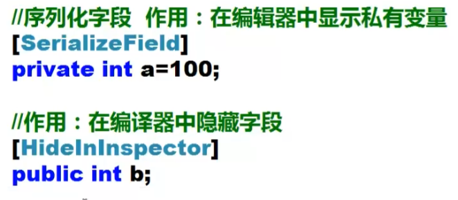
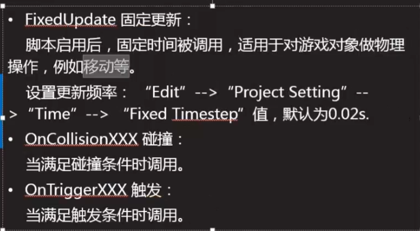

## 脚本基础知识

[SerializedField]显示私有变量

[HideInInspector]隐藏共有变量



在代码中的数据是一个初始值，在编译器界面中的值才是当前游戏的参数值。

- 范围值

  ```jaa
  [Range(0.100)]
  public int c;
  ```

  

- 属性

  public  int A{

  ​	set{

  ​		this.a = value;

  }

  ​	get{

  ​	return this.a;

  }

  }

- 不要在脚本中写构造函数

  - 写也可以，别访问unity有关的东西

## 脚本生命周期

```java
开始  都是执行初始化
1.Awake   //物体创建执行
2.start()   //脚本启用执行
    
多个同时执行的时候，都是先将awake执行完
    
禁用掉就不会执行了
    
    
3.onEnable脚本启用就会调用
4.fixUpdate()  物理阶段  每隔固定时间执行一次，可以进行修改，不会受到渲染影响   0.02s
5.一般也不会在上面的做，updte()会在渲染的时候执行，
6.lateUpdate()  update之后做。 在同一帧做。
    
7.渲染
    1.看见了执行 onBecameVisible（）
    2.看不见执行 OnBecameInvisible()
```




## 调试

- 写log    window --- console        窗口---> 常规 --->  控制台

  ```java
  Debug.Log("start---"+Time.time);
  print("ok");
  ```

  点第一个显示

- 将变化的变量显示到控制面板中

- 复杂的使用vs调试

  - 安装vstu工具
  - 再可能出问题的地方加断断点，然后回到unity运行。

- 查看数据

  - 即使窗口
  - 直接打开即使窗口栏

## 查看原代码

- ILPy工具进行反编译
- 找到dll文件的位置，然后进行反编译就可以了。


## Api

component/transform/GameObject/Object

component 下有behavier在有mon


## transform

使用的过程中，需要注意自身的坐标系和父类发坐标系 ，

transform.Translate()

transform.Rotate()    Space.self   Space.World

transform.RotateAround(点，轴，转);


setParent  设置儿子


find()；找儿子，不可以找孙子    可以自己写递归查找。


激活状态

activeInHierarchy      activeSelf

setActive(bool)


添加组件

```java
创建物体
GameObject lightGo = new GameObject();
//添加组件
Light light = new lightGo.AddComponenet<Light>();
//设置属性
light.color = Color.red;
light.type = LightType.Point;
```


GameObject.Find("") 查找所有，慎用

transform.find("")找儿子

GameObject.FindGameObjectTag("")//找到所有的

GameObject.FindWithTag("")//找到一个 

FindObjectOfType<T>  返回类型的都一个激活的加载都对象

FindObjectsOfType<T> 所有的

Instantiate  克隆原始物体