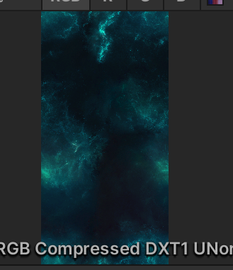

# shooter

space shooter案例

## 导入资源

导入资源

## 配置大小

- 根据美术资源的长宽高得到游戏的长宽高

这个图片是1024x2048所以游戏的比例是1:2

## 音乐播放

在相机上有一个监听器

没有它是不可以听到音乐的，添加音乐组件需要加 一个Audio source。

这个可以加载相机上，可以加在背景上，相机上是有一个耳朵的 。

**耳朵只有一个，但是可以有好多中声音**

**创建预制体只会调用awake函数不对调用start函数**