# Unity

unity游戏引擎，unity4.0开始支持跨平台，支持的语言C#.

## 材质使用

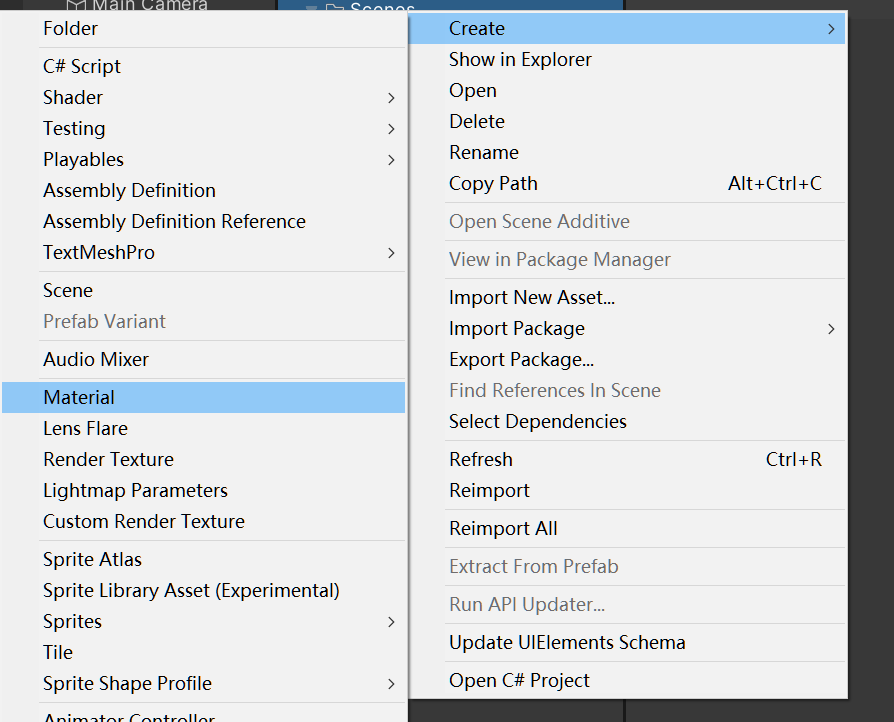

创建材质

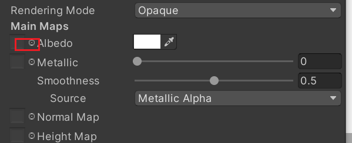

设置材质,创建一个cube,然后将材质拖到材质上面就可以了。

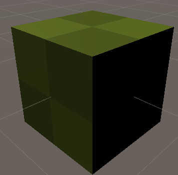

## 音效

添加音效，点击相机，添加组件，相机听到的东西就是我们可以听到的东西。

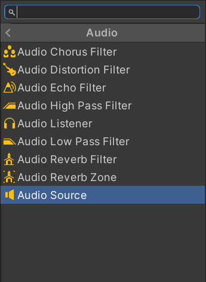

##  场景试图的相关操作

- 一个物体放的很远，想让它近一些。

  方法一：双击物体

  方法二：点击物体按下F键

- 

## 五大视图

1.场景视图：编辑游戏对象，游戏对象的显示  

2.游戏视图：游戏运行的实际效果

3.检视视图：显示游戏的相关属性的

4.层次视图：所有对象的层次关系

5.工程视图：整个项目运用的资源

## Transform

unity游戏项目架构

- 场景-->层--->游戏对象 --->组件  （组件编程）

旋转  平移 缩放  描述一个3D物体的位置和行为。

创建脚本的时候需要注意：

- 类名和脚本的名称需要保持一致，否则无法挂载
- 类继承了MonoBehavior才可以进行挂载

## 修改模板

安装路径的位置，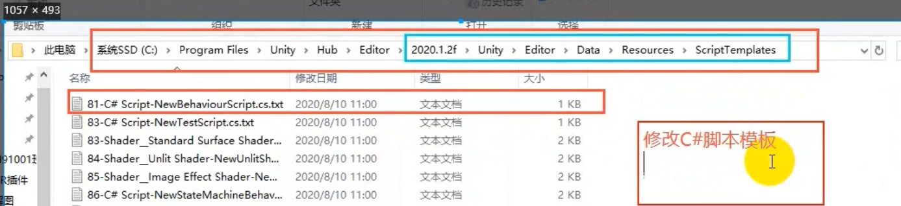

### 位移

可以设置z,y,z，可以进行重置，重置之后位置为0，缩放为1   

##  transform如何获取到组件

- 获取自己的组件

  getComponent<Transform>

- 获取别人的组件

  GameObject.Find("sun").getComponent<Tranform>();

获取游戏组件，设置游戏位置

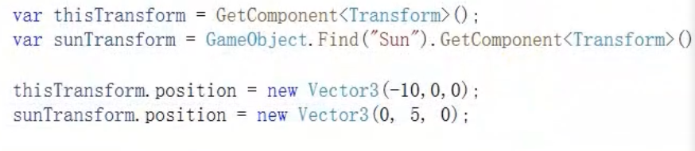

属性在unity中无法进行可视化，共有字段可以进行可视化。、、

- position

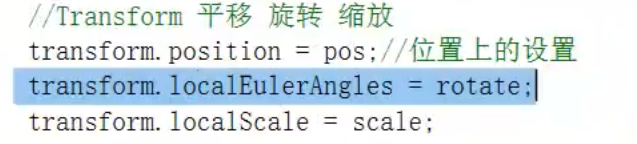

持续转动

- transform.Translate(new Vector(0,1,0)\*sSpace.Worldpeed\*Time.deltaTime,Space.World)

- 绕着地球的轴进行转动

  transform.Rotate(new Vector3(0,10,0)*Time.deltaTime,Space.World);

  //绕着y旋转，根据的是世界坐标

  transform.Rotate(new Vector3.up

- 

## 向量类

Vector2()  x，y 

Vector3()

## 案例 

地月系 

创建一个地球，一个太阳，使得地球绕着太阳转就可以了。

## 设置游戏显示的颜色

默认显示的是天空盒

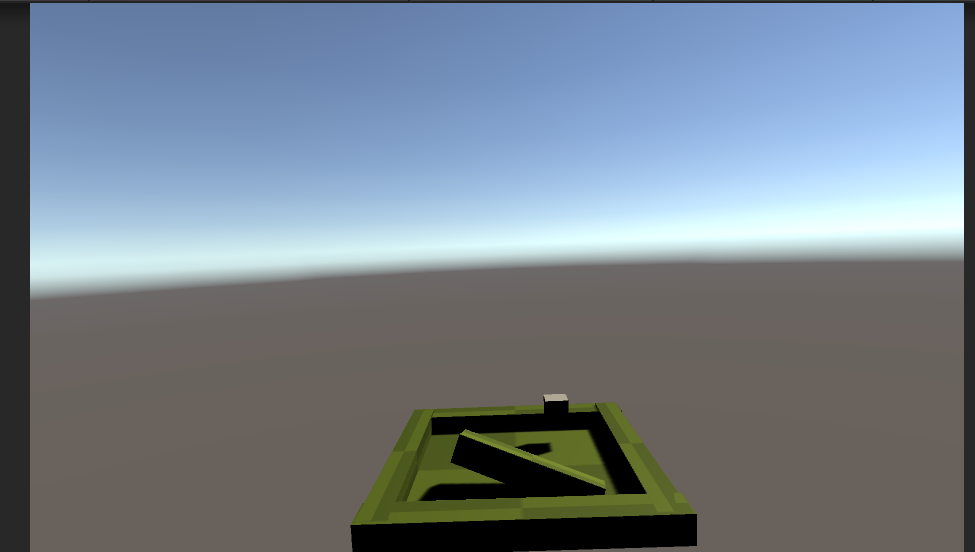

可以对相机进行设置颜色。

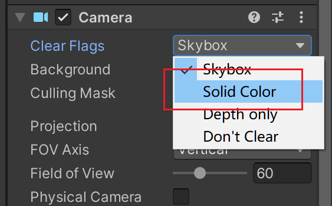

## 天空盒设置

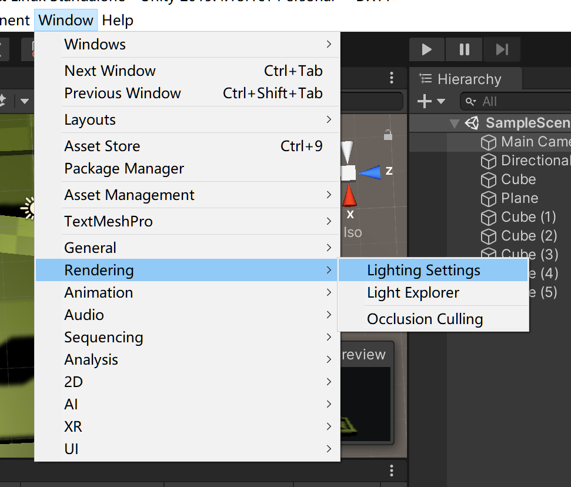

### 自定义天空盒

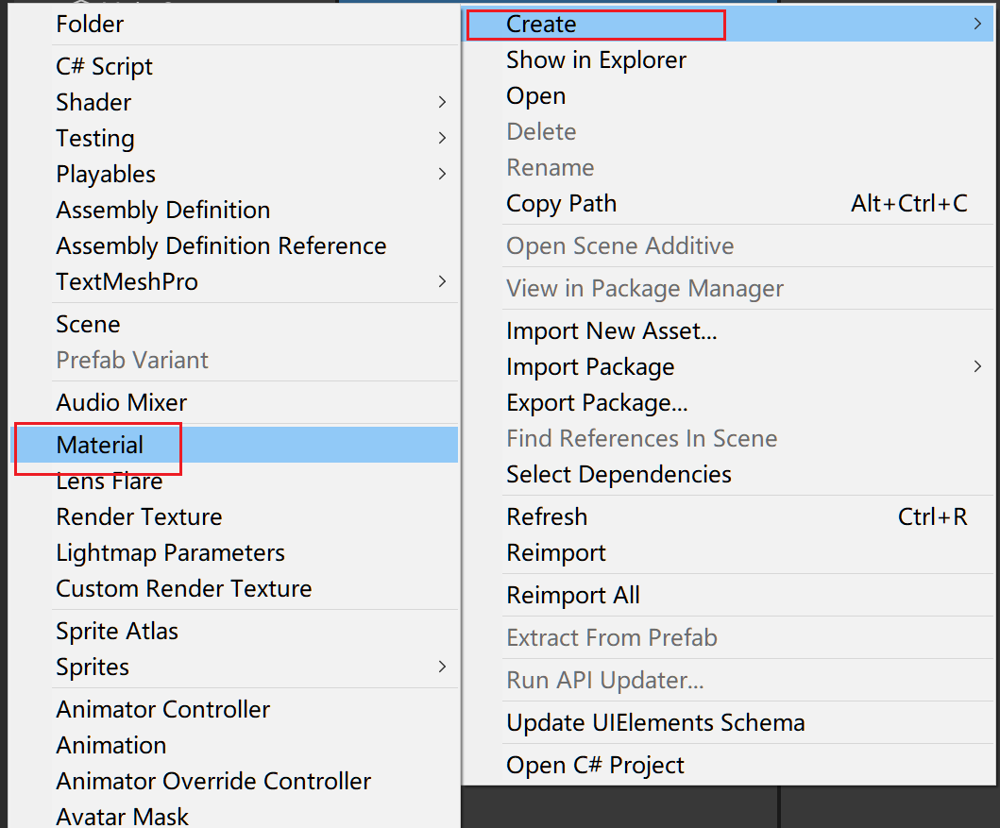

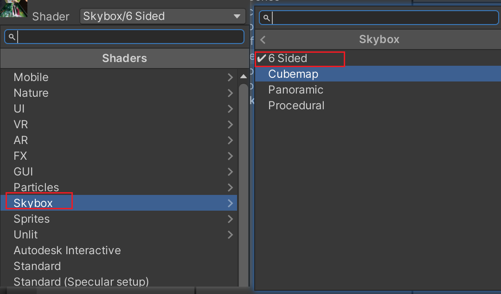

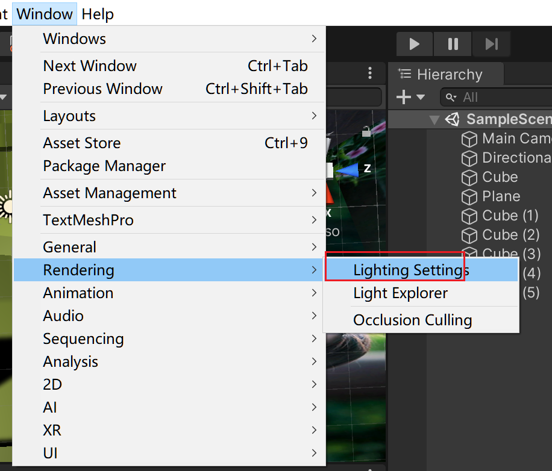

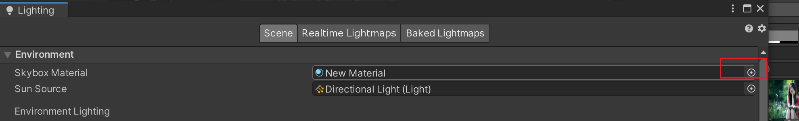

## 回顾

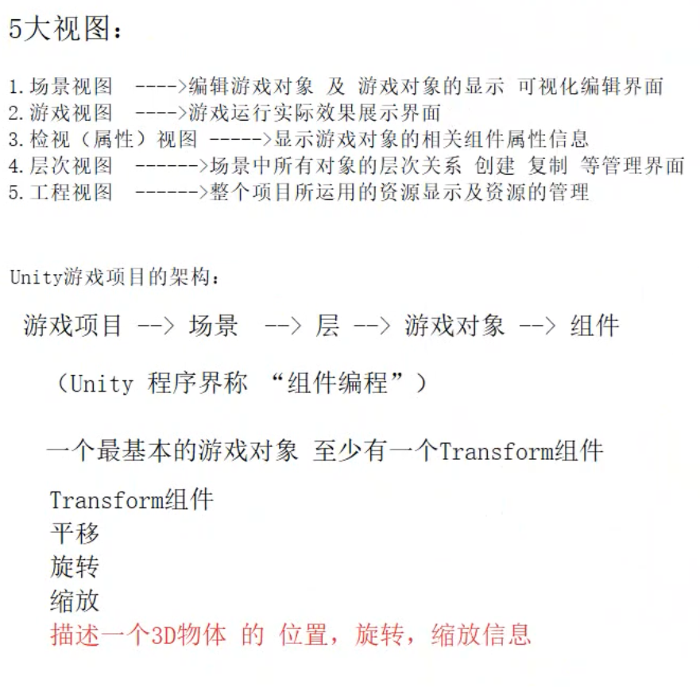