#  生命周期

- awake:只会调用一次，初始化的时候调用   使用预制体的时候调用一次

  挂在在那个物体上就创建一次。

- prefab：预制体  unity特殊的资源

  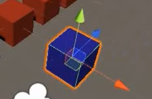

  预制体创建出物体，给其中一个设置颜色，然后

  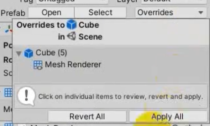

  就可以使用到所有的物体上。

- start:当对象被激活的使用调用一次

- update:每帧执行 0.02s，根据刷新频率

- fixedUpdate:固定更新，没0.02秒，一般用于物理模拟。

  Time.time：程序运行时间

- LateUpdate：紧跟update之后

- onEnable/onDisable:每启动/禁用调用一次

- onDestory:销毁的时候调用

- reset:重置

## 常用类

Time时间类

- Time.deltaTime:上一帧到当前帧的偏移的时间

- Time.time：程序运行的时间

  秒表:

  ```c#
  float time = 0;
  if(Time.time - time>1){
      print();
      time = Time.time;
  }
  ```

Debug调试类

- 错误：LogError("错误信息！");
- 普通:Log("普通信息");
- LogWarning("警告信息");

GameObject:游戏对象类

- 创建删除对象

  每秒创建一个对象

  ```c#
  GameObject go = GameObject.Instantiate(prefab);
  
  删除对象
  GameObject.Destroy(go);
  //延迟删除
  GameObject.Destroy(go,3);
  ```

- 找到对象

  ```java
  GameObject.find("对象名");
  GameObject mao = GameObject.findGameObjectWithTag("mao");
  //如果我们让它转动
  mao.AddComponent<脚本名>();//就会执行脚本的生命周期
  ```

  找到多只猫

  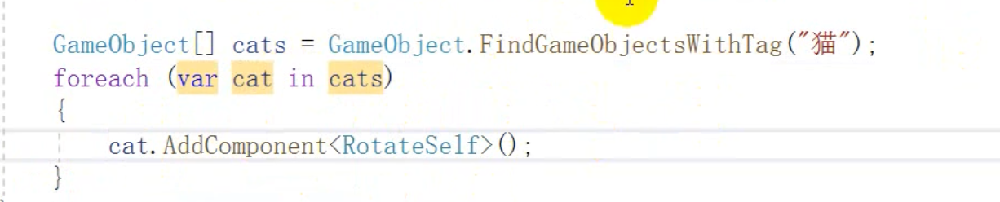

Input:输入类

- 按键控制

  update方法：Input.GetAxis("Horizontal");  //vertical

  -1到1之间 

- 相机跟随，将照相机直接扔向对象

  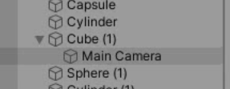

  相机跟随的方法二

  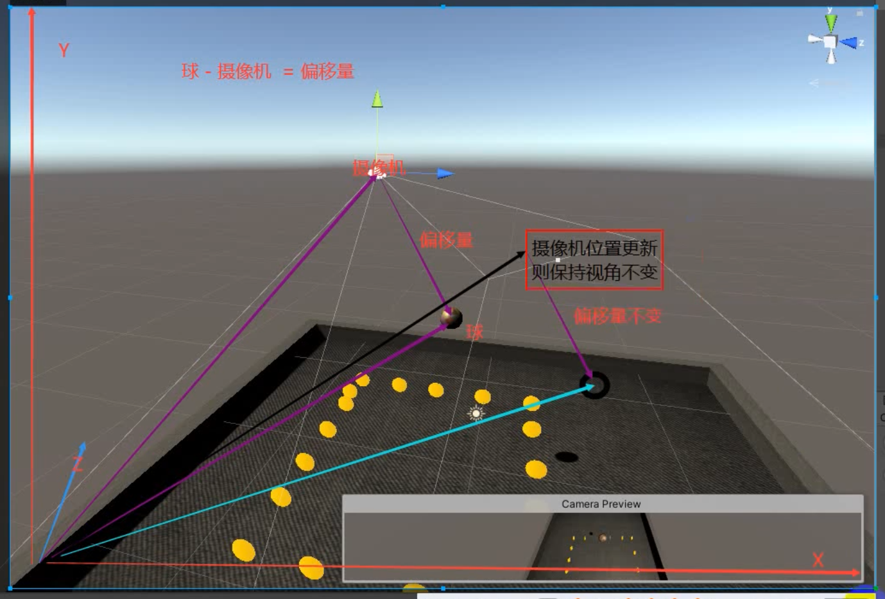

  相机跟随代码

  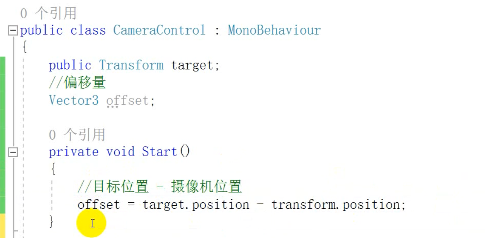

  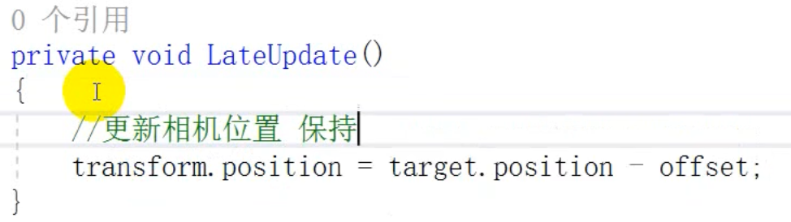

  

  使得物体进行移动，相机跟随，只需要将相机扔给对象就可以了

  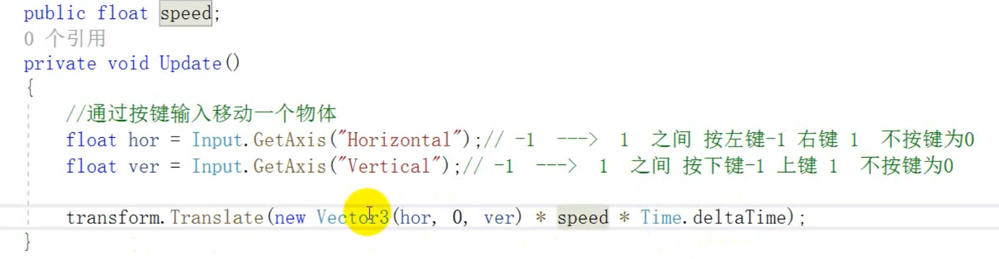

- 键盘按下

  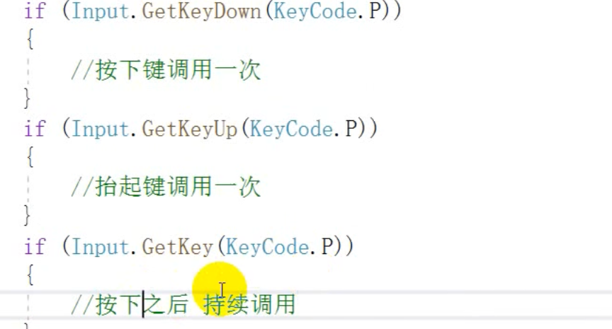

- 鼠标

  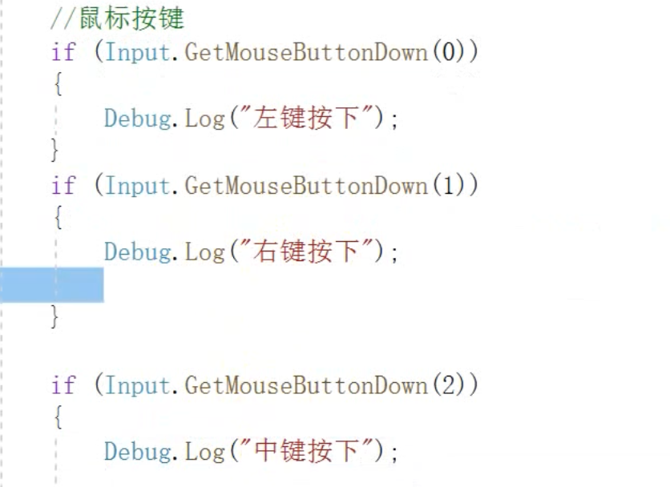

- 事件函数

## MathF

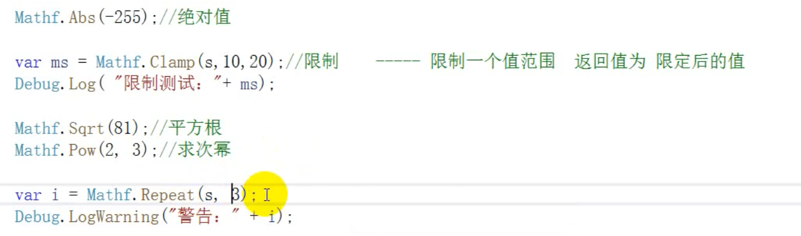

MathF:数学常用类

Transform:变换组件类


## 刚体

物理引擎，用于模拟世界中物体的受力运行状态 。

刚体组件：用于模拟3D世界物体受力，运行效果，不会变形的物体。

是一种组件。

### 使用

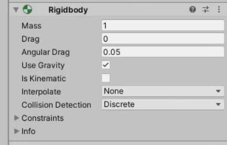

刚体组件。

- 质量

- 阻力  
- 旋转阻力：园滚动的一个阻力
- 使用重力
- 不受任何力的 影响,动力学
- 平滑运动，使得运动更加逼真
- 碰撞方式

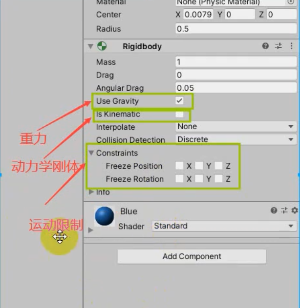

限制位移，限制旋转

## 旋转

transform.up//自身 

Vector.up//世界的

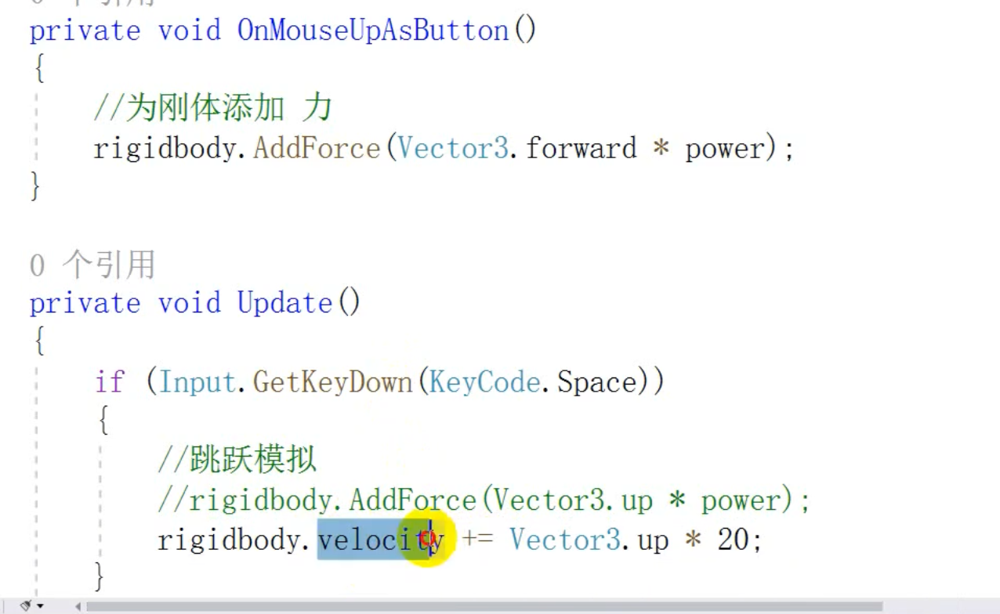

- 朝上的一个力
- 点击空格可以朝上运动
  - 向上的一个力
  - 向上的一个速度

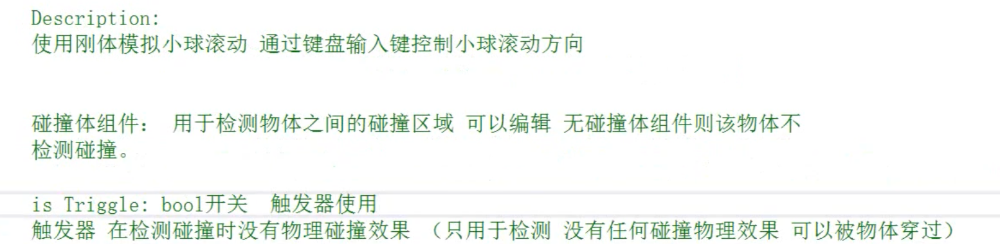


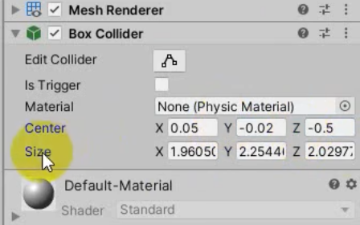

碰撞器的材质：不是使用普通的材质，比如篮球，它有弹力

center它是设置位置的     size:设置他的大小


Mesh Collider：它是网格碰撞器，比如桥


## 碰撞检测的

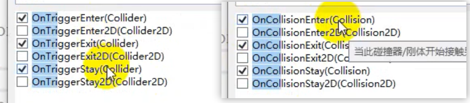

### 碰撞器检测方法

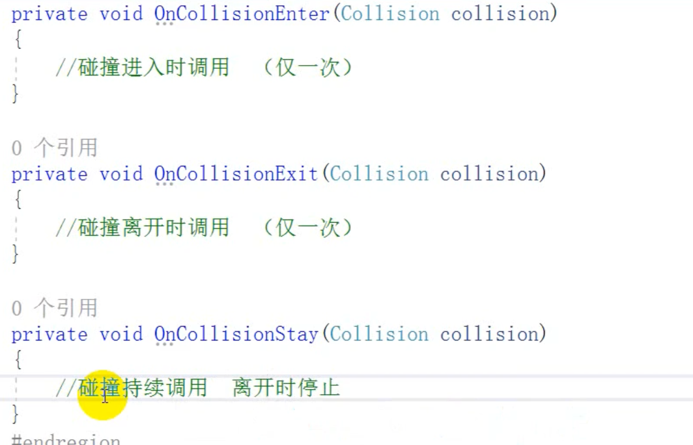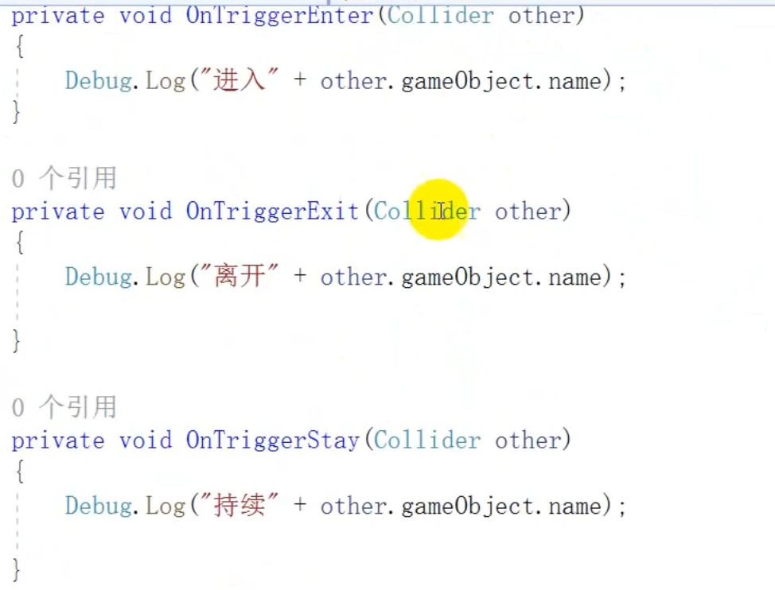


**双方是碰撞器时，并且一方刚体组件的时候可以触发**

### 触发器检测方法


**必须有一方是触发器，必须一方有刚体组件**

触发之后做操作

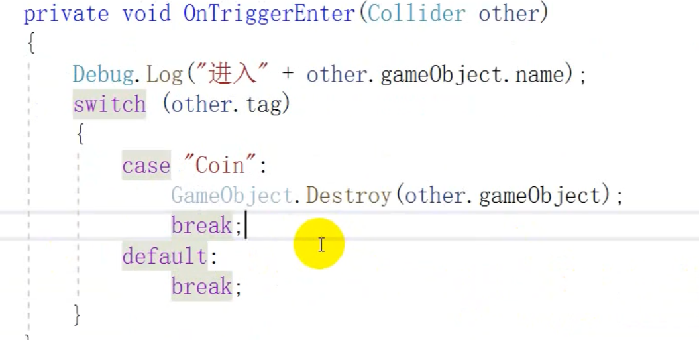

说一下区别：

在libGdx中碰撞的时候，它是将碰撞器加载在刚体上的，参数里面可以获取到发生碰撞的两个物体。

在这里，碰撞方法在脚本中，直接实现就可以了，然后当前的物体是this,发生碰撞的另一个是collision.gameObject.name。

## 案例

Roll a ball


