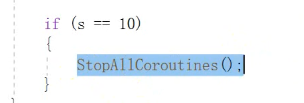

# 协程

多线程：一个应用程序，里面通过多个线程来执行，cpu在各个线程之间进行告诉的切换。在unity中存在一种类似效果的操作，它不是多线程，但是可以实现多线程的效果，开销小。

unity的处理方式：某个操作比较浪费，那么就开一个协助程序，来一起执行

 协程：协同程序，在主线程中开启一个子程序，协同子程序进行异步操作，类似于多线程，本质不是多线程。

使用：

- 定义协程程序函数
- 开启协程
- 关闭

协程里面还可以继续开协程。

特点：

- 返回值是一个IEnumerator接口

- yield return不是返回值

  它是一个等待效果，不是执行结果的结束程序。

  yield return null:等待一帧的效果。

  yield return new WaitForSeconds(s)

- 开启

  StartCoroutine("Time");

- 关闭

协程里面也可以开启一个新的协程。

关闭指定的

带参数的协程

