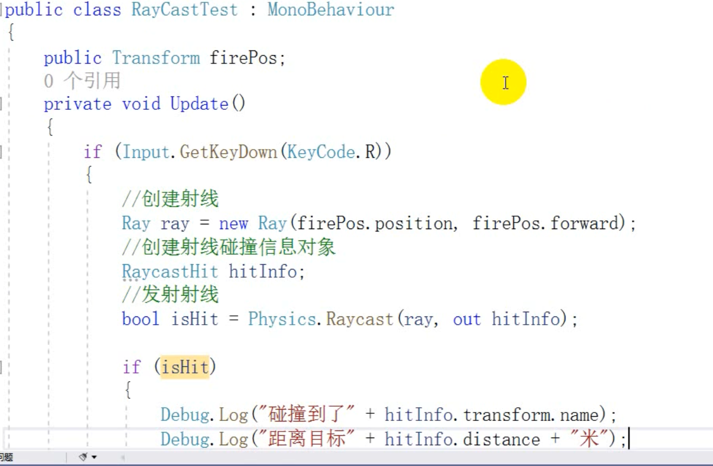
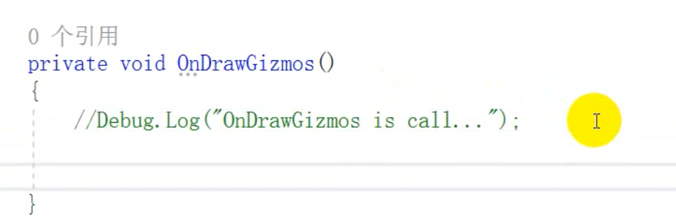
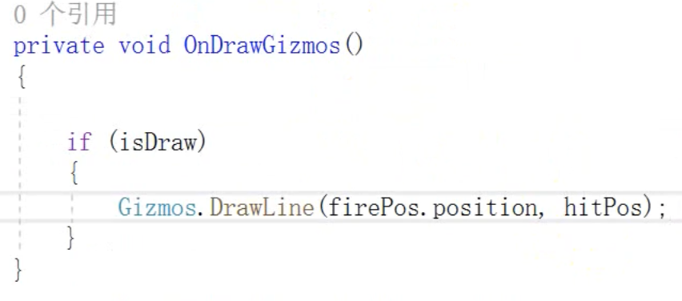
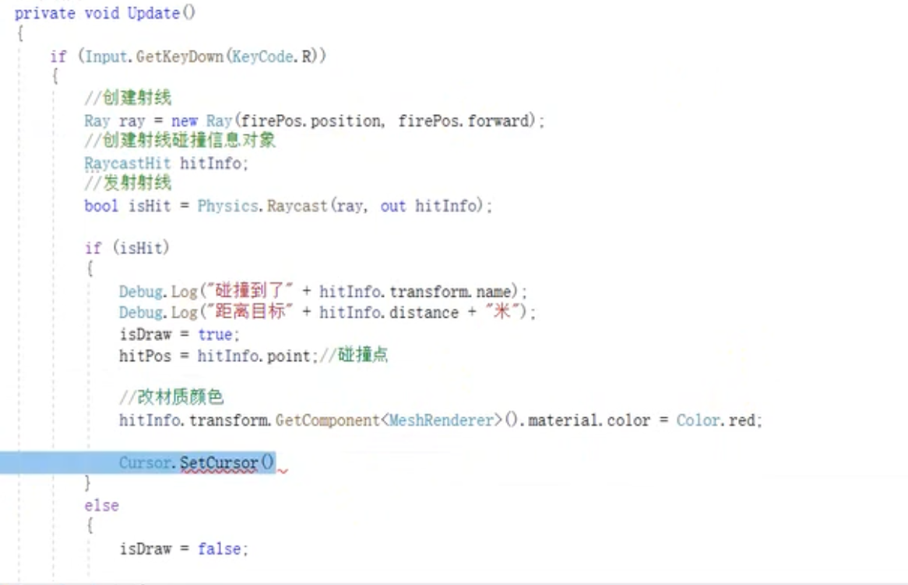
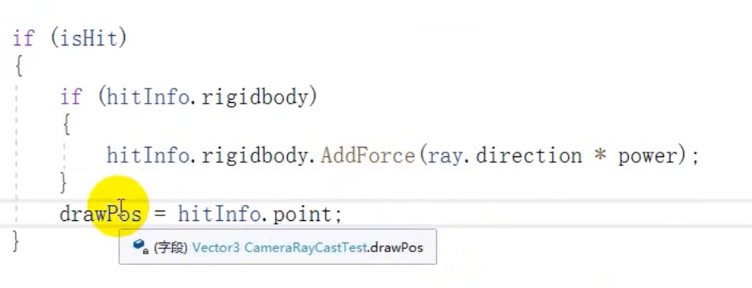
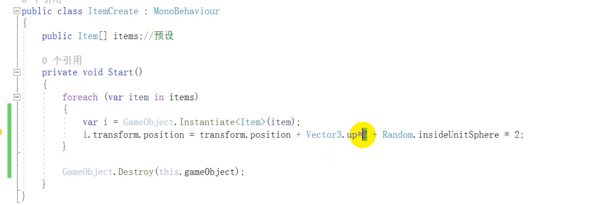

# 射线

射线检测：unity中除了碰撞组件以外的一种碰撞检测的方式，从一个源点想一个指定方向发射一条无止境的射线unity可以检测过程中所有的碰撞对象。

前提：该检测的物体 必须要有碰撞体。

## 使用

  场景发生变化的时候调用

我们使用这个方法来做辅助线。

- 我们获取碰撞点

  Vec3 pos = hitInfo.point;

- 画线

  Gizmos.DrawLine(firePosition,pos);

  

  完整使用案例

  

## 案例

从摄像机向屏幕中发送一条射线。给刚体一个力，力的方向是射线的方向。

## 装备爆开

