## 素材

### 素材有哪些

- 图片

  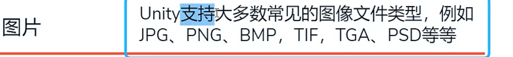

- 音效

  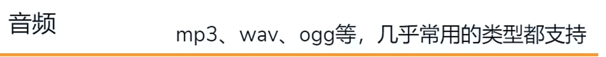

- 视频

  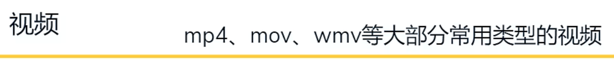

- 模型

  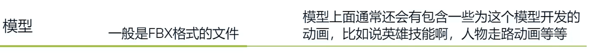

- 粒子特效

  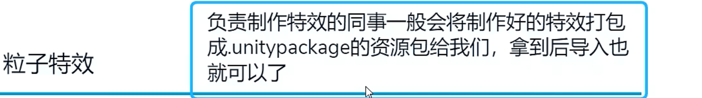

- 字体

  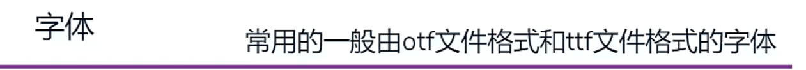

- 场景

  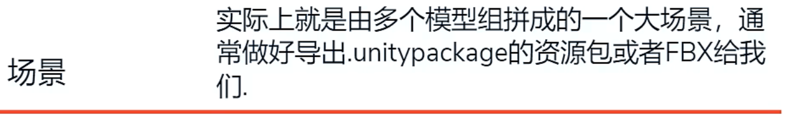

### 资源如何管理

- 按照模块进行
- 删除资源，删除之后去回收站进行还原恢复。

## 图片

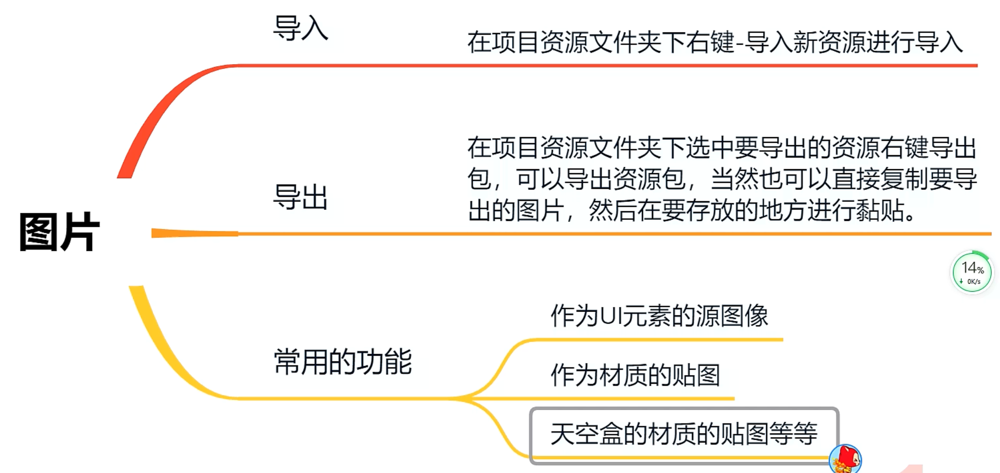

- 导入资源

  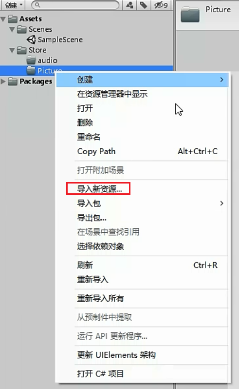

- 图片创建按钮

  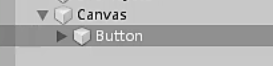

  图片创建一个按钮，然后将图片拖到sprite中。

  **这个时候形状有点怪，可以点击设置 原生大小，来改变按钮图的大小。**

### 导出

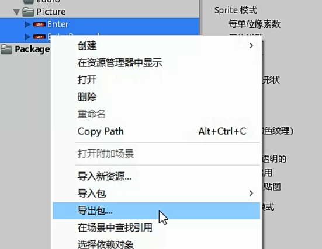

导入 可以直接拖入到unity中。

## 音视频

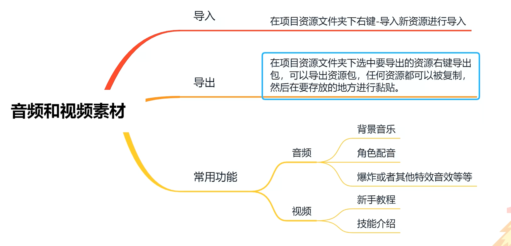

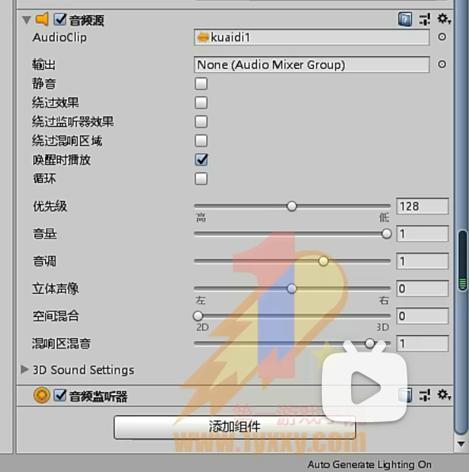

## 粒子和字体

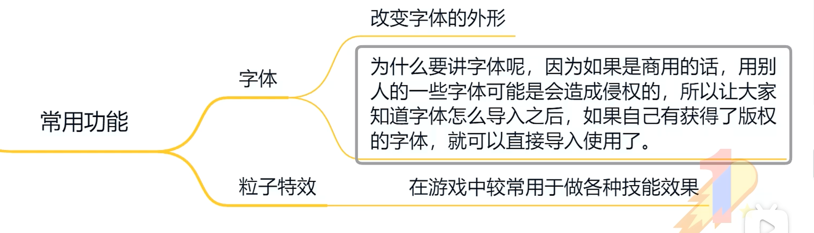

## 模型  场景

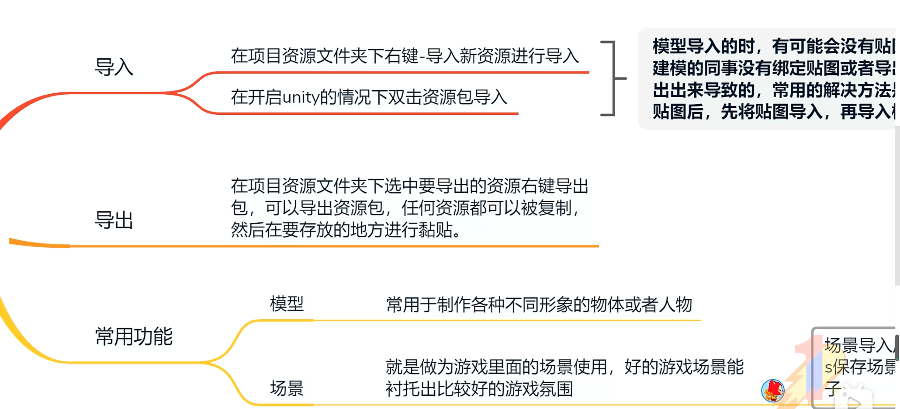

## 脚本管理

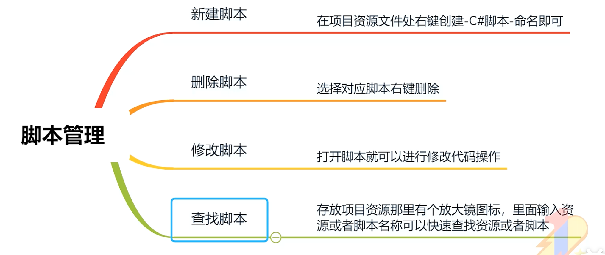 

