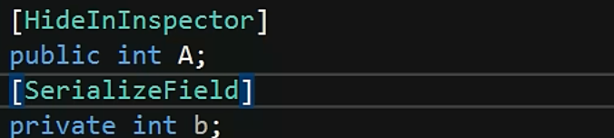

# 脚本的生命周期

## 脚本的执行顺序

awake    enable  reset(运行情况下，挂组件)  start  fixedUpdate(0.02s执行一次)   update(每帧执行一次)  laterUpdate（update之后执行）

### 脚本

- 共有的在编译器中隐藏，私有的在编译器中显示

 

- 设置范围

  

- 私有可以不写private，默认就是私有的

**类名和文件名必须是一样的，负责无法挂载**

