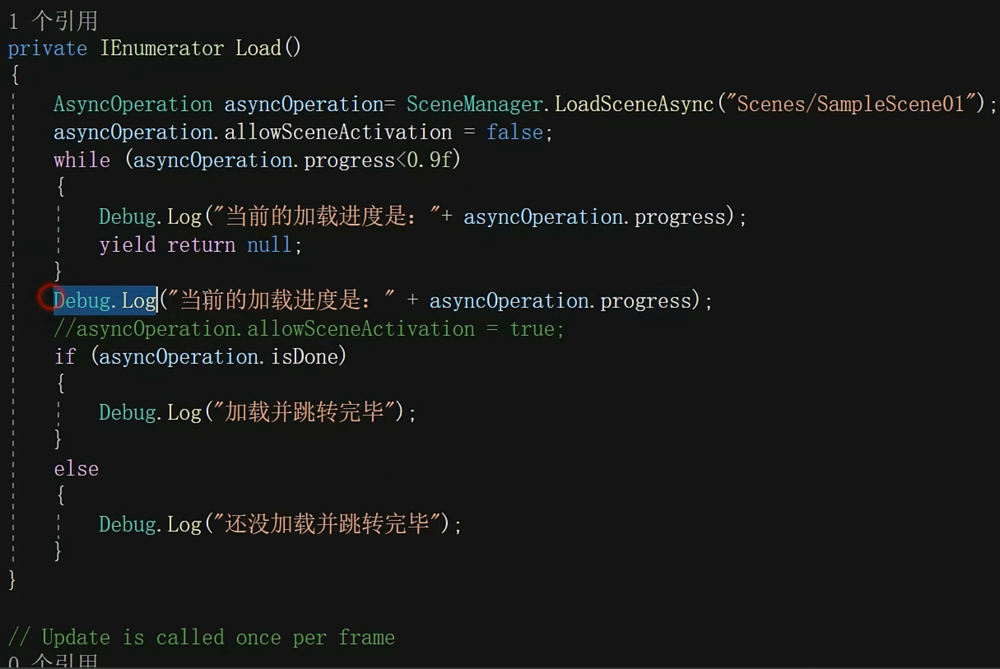

# 场景管理


## 操作

创建   删除   修改  保存  恢复(去回收站进行还原)


## 创景加载

### 同步加载


加入场景的时候，可以使用下标进行加入。


第二个参数是场景的叠加模式


加载场景还可以通过名称进行加载

```java
SceneManager.LoadScene("");
```

### 异步加载


异步加载一般都是使用协程来完成的，每次可以间隔在来获取，没有必要一直加载进度。、




## 当前物体包留到下一个

