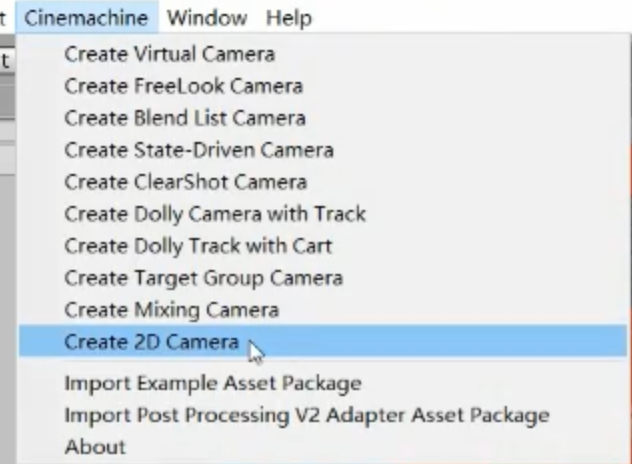
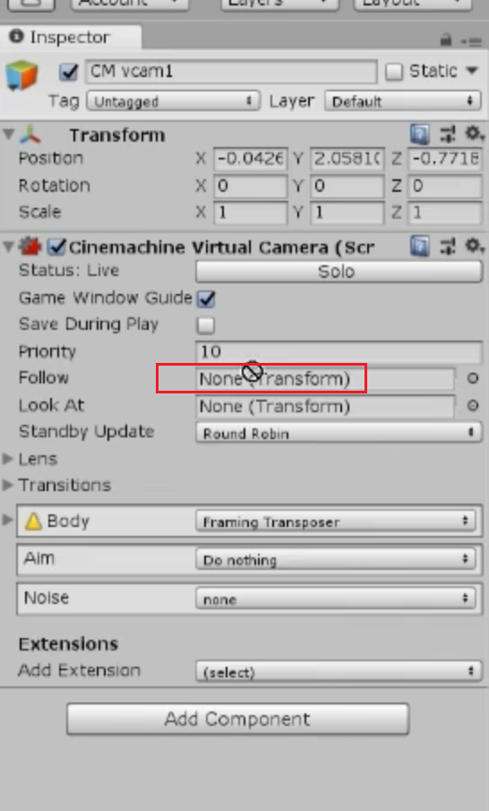

# 移动

根据键盘输入进行控制上下左右。

```java
//自己运动
// transform.Translate(transform.right * speed * Time.deltaTime);
//按键控制运动
float moveX = Input.GetAxisRaw("Horizontal");
float moveY = Input.GetAxisRaw("Vertical");
// 两个都没有错，v2它会去掉
Vector3  vv = transform.position;  
Vector2 position = transform.position;
position.x += moveX * speed*Time.deltaTime;
position.y += moveY * speed* Time.deltaTime;
transform.position = position;
```


# 碰撞

加入刚体可以进行碰撞，但是碰撞之后就会出现很多的问题。

### 碰撞之后发生抖动

处理方法：使用rbody.MovePosition(position);   这个果然有用。


```java
//自己运动
// transform.Translate(transform.right * speed * Time.deltaTime);
//按键控制运动
float moveX = Input.GetAxisRaw("Horizontal");
float moveY = Input.GetAxisRaw("Vertical");
// 两个都没有错，v2它会去掉
Vector3  vv = transform.position;  
Vector2 position = transform.position;
position.x += moveX * speed*Time.deltaTime;
position.y += moveY * speed* Time.deltaTime;
//   transform.position = position;
//   rigidbody.position = position;
rigidbody.MovePosition(position);
```


### 碰撞之后发生翻转


### 始终显示在最上方


处理方法就是物体 高过一定位置之后就出现在后面


自定义轴进行排序。这个操作有一个前提条件就是进行二者变化的时候需要在同一个层级。

## 相机跟随

导入包


导入


使用包创建相机



